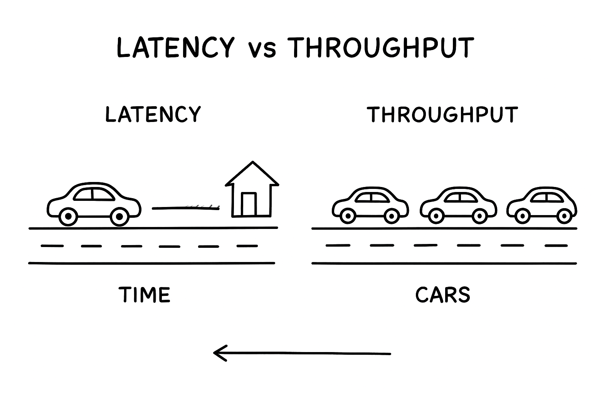

Latency : 
Definition: Time taken to complete one request end to end.
Think of it as delay to process one request
Usually it measured in milliseconds.
Example:
"You click on the google search->Time taken to show first result"=Latency
Goal: Keep latency as low as possible for better user experience

Throughput
Definition: No of requests a system can handle per unit of time
Measure in request per seconds(RPS), transaction per seconds(TPS) and Queries per seconds(QPS)
Example:Number of cars that can pass in the highway per seconds 
Goal: Maximize throughout so system can handle maximum number of user

Latency Vs Throughput
Latency is delay in one request and Throughput is total requests handle per seconds
Latency is measured in milliseconds and Throughput is measured in request/seconds
Latency reduces reponse time and Throughput is increase system capicity
Latency example: 0.2 second to return search query and 200,000 queries per seconds

Trade-offs:
Sometimes improving one can hurt another
Example:A server can batch 100 request(high throughput), but add delays(high latency)
Example:A server can respond in 0.02 seconds(low latency), but can only handle(20 request)

Interview Tips:
Always ask the interview whether he is asking for faster response(low latency) or high capicity(high throughout)
Banking System:priorities low latency(transaction must be quick)
Analytics System:priorities high throughput(millions of logs per seconds)

Summary:
Latency:speed for one request to complete end to end.
Throughput:how many request your system can handle at once.

